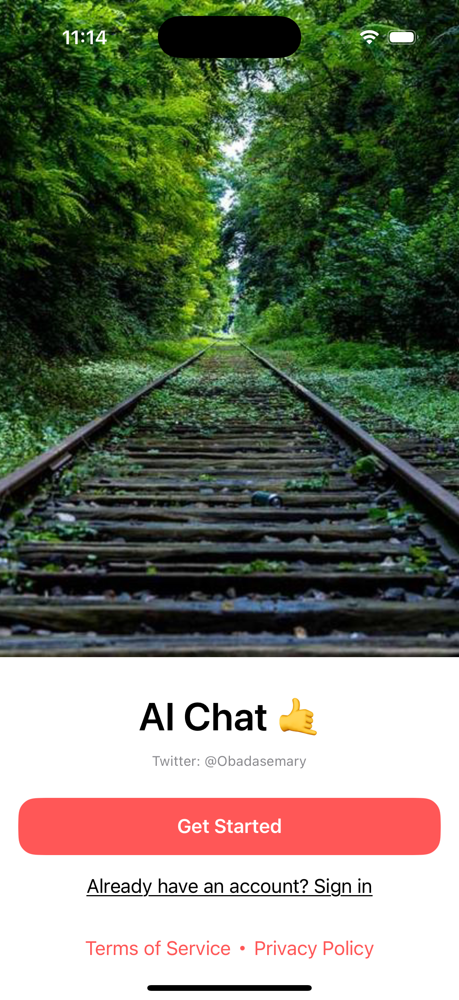
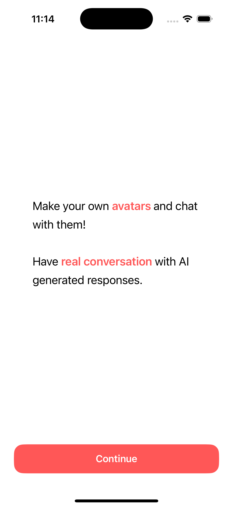
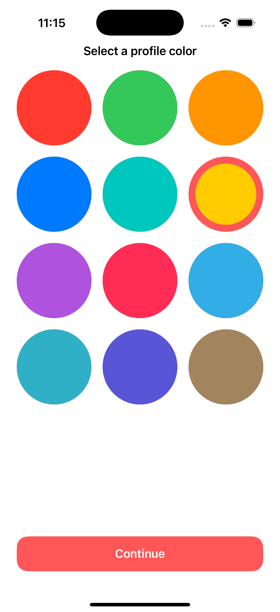
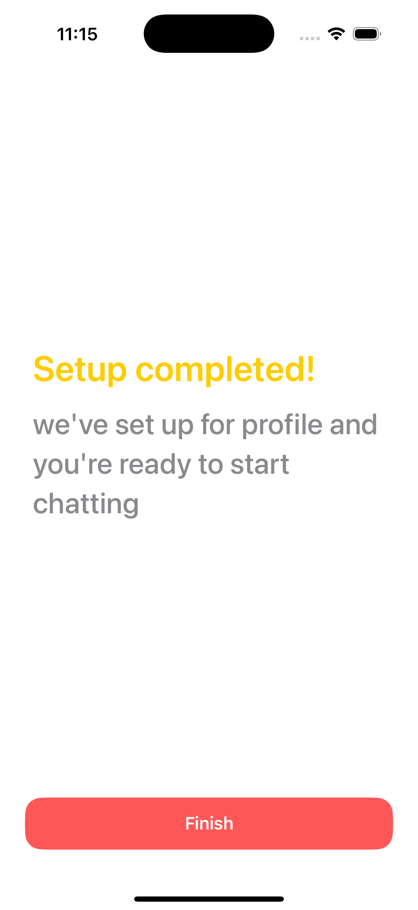
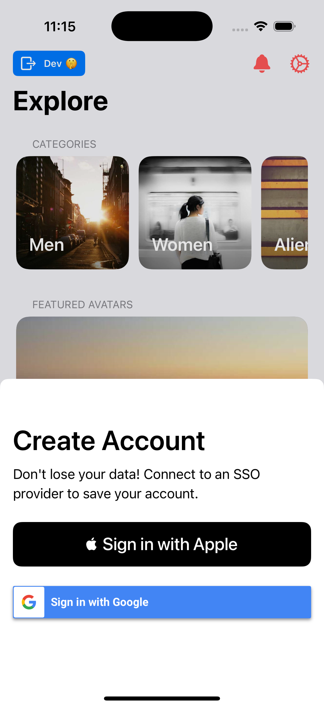
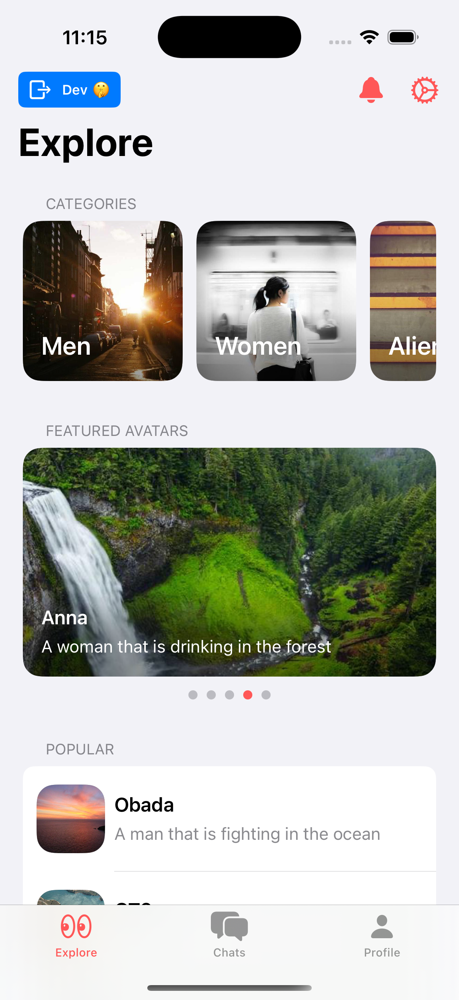
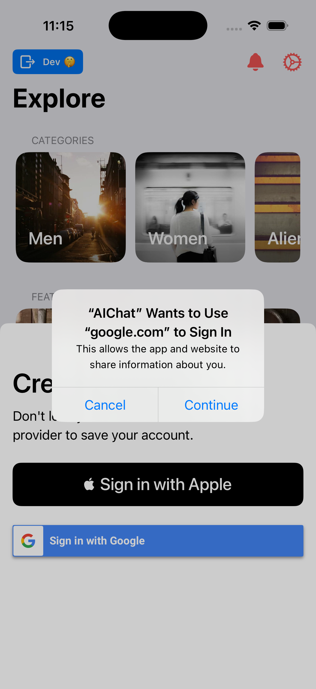
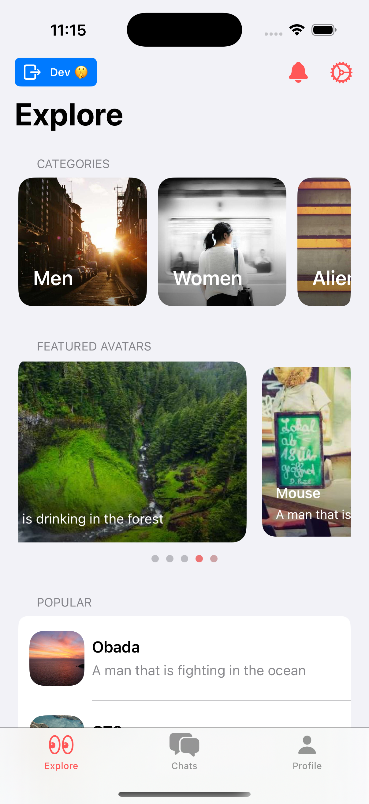

# 🤖 AIChat - AI-Powered Chat Application

[](https://github.com/obadasemary/AIChat/actions/workflows/CI.yml)
[](https://swift.org)
[](https://developer.apple.com/ios/)
[](https://developer.apple.com/xcode/)
[](LICENSE)

<div align="center">
  
  
  **Intelligent conversations powered by OpenAI's advanced language models**
</div>

---

## 📱 About AIChat

**AIChat** is a sophisticated iOS application that provides an intelligent, conversational experience powered by OpenAI's cutting-edge language models. Built with modern iOS development practices and enterprise-grade architecture, AIChat offers users a seamless way to interact with AI for various purposes including learning, problem-solving, creative writing, and more.

### ✨ Key Features

- **🤖 AI-Powered Conversations** - Engage with OpenAI's advanced language models
- **💬 Rich Chat Interface** - Beautiful, intuitive chat experience with message history
- **👤 User Authentication** - Secure Firebase-based authentication system
- **🎨 Avatar Creation** - Personalized user avatars and profiles
- **📊 Analytics Integration** - Comprehensive user behavior tracking with Mixpanel
- **🔒 Enterprise Security** - Professional-grade security and configuration management
- **📱 Modern iOS Design** - Built with SwiftUI and following iOS design guidelines
- **🧪 A/B Testing** - Sophisticated testing framework for feature optimization
- **💳 Subscription Management** - Integrated in-app purchase system
- **🔔 Push Notifications** - Real-time notifications for enhanced user engagement

---

## 🏗️ Architecture Overview

AIChat follows **Clean Architecture** principles with **MVVM** pattern, ensuring maintainability, testability, and scalability.

### 📁 Project Structure

```
AIChat/
├── App/                    # Application entry points and dependencies
├── Core/                   # Core business logic and features
│   ├── AppView/           # Main app view and navigation
│   ├── Chat/              # Chat functionality and AI integration
│   ├── Chats/             # Chat list and management
│   ├── Profile/           # User profile and settings
│   ├── Onboarding/        # User onboarding flow
│   ├── Paywall/           # Subscription and payment handling
│   └── Settings/          # App configuration and preferences
├── Services/               # External service integrations
│   ├── AI/                # OpenAI API integration
│   ├── Auth/              # Firebase authentication
│   ├── Chat/              # Chat data management
│   ├── User/              # User data and profile management
│   ├── Avatar/            # Avatar creation and management
│   ├── PushNotifications/ # Push notification handling
│   ├── Purchases/         # In-app purchase management
│   └── ABTests/           # A/B testing framework
├── Components/             # Reusable UI components
├── Utilities/              # Helper functions and extensions
└── Assets.xcassets/        # App icons and visual assets
```

### 🎯 Architecture Patterns

- **MVVM (Model-View-ViewModel)** - Clean separation of concerns
- **Builder Pattern** - Dependency injection and view construction
- **Repository Pattern** - Data access abstraction
- **Service Layer** - External API integrations
- **Protocol-Oriented Programming** - Swift best practices
- **Dependency Injection** - Testable and maintainable code

### 🔧 Technology Stack

- **Frontend**: SwiftUI, Combine
- **Backend**: Firebase (Auth, Firestore, Storage)
- **AI Integration**: OpenAI API
- **Analytics**: Mixpanel
- **Testing**: XCTest, Mock services
- **Build System**: Xcode, Swift Package Manager
- **CI/CD**: GitHub Actions

---

## 🖼️ App Screenshots

<div align="center">
  <h3>🎯 Core User Experience</h3>
  
  <table>
    <tr>
      <td align="center">
        <strong>Onboarding</strong><br/>
        
        <br><em>Beautiful nature-themed welcome screen</em>
      </td>
      <td align="center">
        <strong>Chat Interface</strong><br/>
        
        <br><em>AI-powered conversations</em>
      </td>
      <td align="center">
        <strong>User Profile</strong><br/>
        
        <br><em>Personalized avatar management</em>
      </td>
    </tr>
  </table>

  <h3>⚙️ App Features & Settings</h3>
  
  <table>
    <tr>
      <td align="center">
        <strong>Settings</strong><br/>
        
        <br><em>Account and app configuration</em>
      </td>
      <td align="center">
        <strong>Avatar Creation</strong><br/>
        
        <br><em>Custom AI avatar builder</em>
      </td>
      <td align="center">
        <strong>Dev Settings</strong><br/>
        
        <br><em>Developer tools and A/B testing</em>
      </td>
    </tr>
  </table>

  <h3>🔍 Discovery & Navigation</h3>
  
  <table>
    <tr>
      <td align="center">
        <strong>Explore</strong><br/>
        
        <br><em>Discover categories and avatars</em>
      </td>
      <td align="center">
        <strong>Chats List</strong><br/>
        
        <br><em>Recent conversations overview</em>
      </td>
      <td align="center">
        <strong>Profile Color Selection</strong><br/>
        
        <br><em>Personalize your profile</em>
      </td>
    </tr>
  </table>
  
  <p><em>📱 All screenshots are placeholder files. Replace them with actual app screenshots for the best visual impact!</em></p>
</div>

---

## 🚀 Getting Started

### Prerequisites

- **Xcode 26.0 - 26.2** (tested range)
- **iOS 17.6 - 26.2** (deployment target to current SDK)
- **Swift 5.9 - 6.2** (compatible range)
- **Apple Developer Account** (for device testing)
- **OpenAI API Key** for AI functionality
- **Firebase Project** for backend services
- **Mixpanel Account** for analytics

### Quick Start

1. **Clone the repository**
   ```bash
   git clone https://github.com/obadasemary/AIChat.git
   cd AIChat
   ```

2. **Copy configuration templates**
   ```bash
   cp Config.template.plist Config.plist
   cp GoogleService-Info-Dev.template.plist GoogleService-Info-Dev.plist
   cp GoogleService-Info-Prod.template.plist GoogleService-Info-Prod.plist
   ```

3. **Configure your API keys**
   - Get your [OpenAI API Key](https://platform.openai.com/account/api-keys)
   - Get your [Mixpanel Token](https://mixpanel.com/settings/project/token)
   - Set up [Firebase Project](https://console.firebase.google.com/)

4. **Add configuration files to Xcode**
   - Open `AIChat.xcodeproj`
   - Add all three plist files to your project
   - Ensure target membership is correct

5. **Build and run**
   ```bash
   # Clean build folder
   Product → Clean Build Folder
   
   # Build and run
   ⌘ + R
   ```

### 📚 Detailed Setup

For comprehensive setup instructions, see our **[📖 Setup Guide](SETUP_GUIDE.md)**.

---

## 🔑 Configuration

### Required API Keys

| Service | Purpose | Cost |
|---------|---------|------|
| **OpenAI API** | AI chat functionality | Pay-per-use |
| **Mixpanel** | Analytics tracking | Free tier available |
| **Firebase** | Authentication, database, storage | Generous free tier |

### Configuration Options

#### Option 1: Configuration Files (Recommended for Development)
- `Config.plist` - API keys and tokens
- `GoogleService-Info-Dev.plist` - Firebase development configuration
- `GoogleService-Info-Prod.plist` - Firebase production configuration

#### Option 2: Environment Variables (Recommended for CI/CD)
```bash
export OPENAI_API_KEY="your-openai-api-key"
export MIXPANEL_TOKEN="your-mixpanel-token"
```

### 🔒 Security

- ✅ All sensitive configuration files are gitignored
- ✅ Template files provide structure without exposing real data
- ✅ Environment variable support for secure CI/CD
- ✅ Professional configuration management system

---

## 🧪 Testing

AIChat includes comprehensive testing infrastructure:

```bash
# Run unit tests
⌘ + U

# Run UI tests
Product → Test → AIChatUITests

# Run specific test plans
Product → Scheme → Edit Scheme → Test → Info → Test Plan
```

### Test Coverage

- **Unit Tests**: Core business logic and services
- **UI Tests**: User interface and user flows
- **Mock Services**: Isolated testing with mock data
- **A/B Testing**: Feature validation and optimization

---

## 📱 Features Deep Dive

### 🤖 AI Chat System
- **Real-time Conversations**: Seamless AI interactions
- **Context Awareness**: Maintains conversation history
- **Response Streaming**: Dynamic content generation
- **Error Handling**: Graceful fallbacks and user feedback

### 👤 User Management
- **Authentication**: Firebase-based secure login
- **Profile Management**: Customizable user profiles
- **Avatar System**: Personalized visual representation
- **Data Persistence**: Local and cloud data sync

### 💳 Subscription System
- **In-App Purchases**: StoreKit integration
- **Subscription Tiers**: Multiple pricing options
- **Feature Gating**: Premium feature access control
- **Payment Security**: Secure transaction handling

### 📊 Analytics & Insights
- **User Behavior**: Comprehensive usage tracking
- **Performance Metrics**: App performance monitoring
- **A/B Testing**: Feature optimization framework
- **Crash Reporting**: Error tracking and resolution

---

## 🔧 Development

### Code Style

- **SwiftLint**: Automated code style enforcement
- **SwiftFormat**: Consistent code formatting
- **Documentation**: Comprehensive code documentation
- **Naming Conventions**: Clear and descriptive naming

### Dependencies

- **Firebase**: Backend services and authentication
- **OpenAI**: AI language model integration
- **Mixpanel**: Analytics and user tracking
- **SwiftUI**: Modern iOS user interface
- **Combine**: Reactive programming framework

### Build Configurations

- **Development**: Debug builds with development services
- **Production**: Release builds with production services
- **Mock**: Testing builds with mock services
- **UITesting**: UI test builds with test data

---

## 📈 Performance

- **App Launch**: Optimized startup time
- **Memory Management**: Efficient resource usage
- **Network Optimization**: Intelligent API caching
- **Battery Efficiency**: Background task optimization
- **Storage Management**: Efficient data persistence

---

## 🚀 Deployment

### App Store

1. **Archive the project**
   ```bash
   Product → Archive
   ```

2. **Upload to App Store Connect**
   - Validate and upload
   - Configure app metadata
   - Submit for review

### Enterprise Distribution

- **TestFlight**: Internal and external testing
- **Enterprise Certificates**: Internal distribution
- **Ad Hoc**: Limited device distribution

---

## 🤝 Contributing

We welcome contributions! Please see our **[Contributing Guidelines](CONTRIBUTING.md)** for details.

### Development Workflow

1. **Fork the repository**
2. **Create a feature branch**
3. **Make your changes**
4. **Add tests**
5. **Submit a pull request**

### Code Review Process

- All changes require review
- Automated testing must pass
- Code style guidelines enforced
- Security review for sensitive changes

---

## 📄 License

This project is licensed under the **MIT License** - see the [LICENSE](LICENSE) file for details.

---

## 🙏 Acknowledgments

- **OpenAI** for providing the AI language models
- **Firebase** for backend infrastructure
- **Mixpanel** for Analytics that drive decisions
- **Apple** for iOS development tools and frameworks
- **Open Source Community** for various libraries and tools

---

## 📞 Support

- **Documentation**: [Setup Guide](SETUP_GUIDE.md)
- **Issues**: [GitHub Issues](https://github.com/obadasemary/AIChat/issues)
- **Discussions**: [GitHub Discussions](https://github.com/obadasemary/AIChat/discussions)
- **Email**: [obada.semary@gmail.com](mailto:obada.semary@gmail.com)

---

<div align="center">
  <strong>Made with ❤️ by the AIChat Team</strong><br/>
  <em>Building the future of AI-powered conversations</em>
</div>
