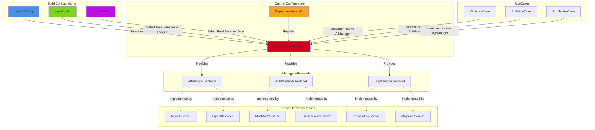
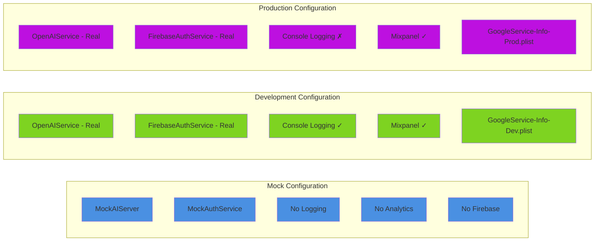
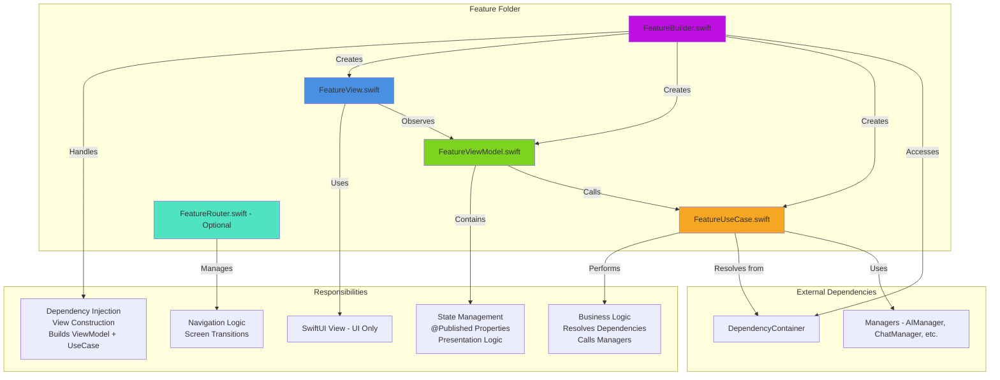

# AIChat Architecture Diagrams

This document contains comprehensive architecture diagrams for the AIChat iOS application.

## Table of Contents
1. [Clean Architecture Data Flow](#1-clean-architecture-data-flow)
2. [Dependency Injection System](#2-dependency-injection-system)
3. [Build Configurations Comparison](#3-build-configurations-comparison)
4. [Feature Module Structure](#4-feature-module-structure)
5. [Services Architecture](#5-services-architecture)

## 1. Clean Architecture Data Flow

```mermaid
graph TB
    subgraph "View Layer"
        A[User Action] --> B[ChatView.swift]
        B --> C[Display State]
    end

    subgraph "ViewModel Layer"
        D[ChatViewModel.swift]
        D --> E[State Management]
        D --> F[@Published Properties]
    end

    subgraph "UseCase Layer"
        G[ChatUseCase.swift]
        G --> H[Business Logic]
    end

    subgraph "Manager Layer"
        I[AIManager Protocol]
        J[ChatManager Protocol]
        K[UserManager Protocol]
    end

    subgraph "Service Layer"
        L[OpenAIService]
        M[FirebaseService]
        N[MockService]
    end

    subgraph "External APIs"
        O[OpenAI API]
        P[Firebase Backend]
    end

    B -->|User Input| D
    D -->|Call UseCase| G
    G -->|Resolve Dependencies| I
    G -->|Resolve Dependencies| J
    I -->|Implementation| L
    I -->|Implementation| N
    J -->|Implementation| M
    L -->|HTTP Request| O
    M -->|HTTP Request| P
    O -->|Response| L
    P -->|Response| M
    L -->|Data| I
    M -->|Data| J
    I -->|Result| G
    J -->|Result| G
    G -->|Process| H
    H -->|Return| D
    D -->|Update State| F
    F -->|Trigger View Update| B
    B -->|Render| C

    style B fill:#4A90E2
    style D fill:#7ED321
    style G fill:#F5A623
    style I fill:#BD10E0
    style J fill:#BD10E0
    style K fill:#BD10E0
    style L fill:#D0021B
    style M fill:#D0021B
    style N fill:#D0021B
    style O fill:#50E3C2
    style P fill:#50E3C2
```

**Data Flow Explanation:**
1. User performs action in View (blue)
2. View triggers ViewModel method (green)
3. ViewModel calls UseCase (orange)
4. UseCase resolves dependencies from DependencyContainer and calls Managers (purple)
5. Managers use Services to communicate with external APIs (red → teal)
6. Response flows back: API → Service → Manager → UseCase → ViewModel → View

---

## 2. Dependency Injection System



**Key Concepts:**
- **DependencyContainer**: Service locator pattern - central registry for all dependencies
- **Dependencies.swift**: Registers all managers based on build configuration
- **UseCases resolve dependencies**: `container.resolve(AIManager.self)`
- **Protocol-based**: All managers are protocols with multiple implementations

---

## 3. Build Configurations Comparison



| Feature | Mock | Development | Production |
|---------|------|-------------|------------|
| **AI Service** | MockAIServer | OpenAIService | OpenAIService |
| **Auth Service** | MockAuthService | FirebaseAuthService | FirebaseAuthService |
| **Console Logging** | ✗ | ✓ | ✗ |
| **Analytics** | ✗ | ✓ (Mixpanel + Firebase) | ✓ (Mixpanel + Firebase) |
| **Firebase Config** | None | GoogleService-Info-Dev.plist | GoogleService-Info-Prod.plist |
| **External API Calls** | ✗ (All mocked) | ✓ | ✓ |
| **Use Case** | UI Testing, Isolated Development | Active Development | App Store Release |

---

## 4. Feature Module Structure



**Standard Pattern for Every Feature:**

1. **FeatureView.swift** (Blue - View Layer)
   - SwiftUI view
   - UI-only code
   - Observes ViewModel state
   - No business logic

2. **FeatureViewModel.swift** (Green - ViewModel Layer)
   - `@Observable` class
   - `@Published` properties for state
   - Presentation logic
   - Calls UseCase methods

3. **FeatureUseCase.swift** (Orange - UseCase Layer)
   - Business logic
   - Resolves dependencies: `container.resolve(AIManager.self)`
   - Orchestrates manager calls
   - Returns results to ViewModel

4. **FeatureBuilder.swift** (Purple - Builder Pattern)
   - Dependency injection
   - Constructs entire feature stack
   - `buildFeatureView() -> some View`
   - Receives DependencyContainer

5. **FeatureRouter.swift** (Teal - Navigation - Optional)
   - Navigation logic
   - Screen transitions
   - Deep linking

---

## 5. Services Architecture

```mermaid
graph TB
    subgraph "DependencyContainer"
        A[Service Selection Based on Build Config]
    end

    subgraph "Protocol Definitions"
        B[AIManager Protocol]
        C[AuthManager Protocol]
        D[UserManager Protocol]
        E[ChatManager Protocol]
        F[LogManager Protocol]
    end

    subgraph "Production Implementations"
        G[OpenAIService]
        H[FirebaseAuthService]
        I[FirebaseUserService]
        J[FirebaseChatService]
        K1[ConsoleLogService]
        K2[MixpanelService]
        K3[FirebaseAnalyticsService]
    end

    subgraph "Mock Implementations"
        L[MockAIServer]
        M[MockAuthService]
        N[MockUserService]
        O[MockChatService]
    end

    subgraph "Service Categories"
        P[AI Services]
        Q[Auth Services]
        R[User Services]
        S[Chat Services]
        T[Purchase Services - StoreKit]
        U[Push Notification Services]
        V[A/B Test Services]
        W[Logging Services - Multi-Service]
    end

    A -->|Registers| B
    A -->|Registers| C
    A -->|Registers| D
    A -->|Registers| E
    A -->|Registers| F

    B -.->|Implemented by| G
    B -.->|Implemented by| L
    C -.->|Implemented by| H
    C -.->|Implemented by| M
    D -.->|Implemented by| I
    D -.->|Implemented by| N
    E -.->|Implemented by| J
    E -.->|Implemented by| O
    F -.->|Implemented by| K1
    F -.->|Implemented by| K2
    F -.->|Implemented by| K3

    B -->|Category| P
    C -->|Category| Q
    D -->|Category| R
    E -->|Category| S

    style A fill:#D0021B
    style B fill:#BD10E0
    style C fill:#BD10E0
    style D fill:#BD10E0
    style E fill:#BD10E0
    style F fill:#BD10E0
    style G fill:#7ED321
    style H fill:#7ED321
    style I fill:#7ED321
    style J fill:#7ED321
    style K1 fill:#7ED321
    style K2 fill:#7ED321
    style K3 fill:#7ED321
    style L fill:#4A90E2
    style M fill:#4A90E2
    style N fill:#4A90E2
    style O fill:#4A90E2
```



**Service Categories:**

| Category | Protocol | Production Implementation | Mock Implementation |
|----------|----------|---------------------------|---------------------|
| **AI** | AIManager | OpenAIService | MockAIServer |
| **Authentication** | AuthManager | FirebaseAuthService | MockAuthService |
| **User Profile** | UserManager | FirebaseUserService | MockUserService |
| **Chat Persistence** | ChatManager | FirebaseChatService | MockChatService |
| **Avatar Management** | AvatarManager | FirebaseAvatarService | MockAvatarService |
| **In-App Purchases** | PurchaseManager | StoreKitService | MockPurchaseService |
| **Push Notifications** | PushNotificationManager | APNSService | MockPushService |
| **A/B Testing** | ABTestManager | FirebaseRemoteConfig | MockABTestService |
| **Logging** | LogManager | ConsoleService, MixpanelService, FirebaseAnalyticsService, CrashlyticsService | MockLogService |

**Key Principles:**
1. Every service has a **protocol definition**
2. Every service has **at least two implementations**: production and mock
3. **DependencyContainer selects** which implementation based on build configuration
4. **UseCases resolve** services from the container, never instantiate directly
5. **Logging is multi-service**: One LogManager coordinates multiple logging backends

---

## Architecture Benefits

### Clean Separation of Concerns
- Views are dumb: UI only
- ViewModels manage state and presentation
- UseCases contain business logic
- Managers abstract service implementations
- Services handle external communication

### Testability
- Mock implementations for all services
- Can test business logic without external dependencies
- UI tests can run in isolation with `.mock` configuration

### Flexibility
- Easy to swap service implementations
- Can add new services without changing UseCases
- Build configurations control which services are used

### Scalability
- Consistent pattern across all features
- New features follow the same structure
- Easy for new developers to understand

---

## Quick Reference

### Data Flow
```
User Action → View → ViewModel → UseCase → Manager → Service → External API
                ↓         ↓          ↓         ↓         ↓
            State Update ← Presentation ← Business Logic ← Response
```

### Dependency Resolution
```swift
// In UseCase
let aiManager = container.resolve(AIManager.self)
let chatManager = container.resolve(ChatManager.self)
```

### Builder Pattern
```swift
@Observable class FeatureBuilder {
    let container: DependencyContainer

    func buildFeatureView() -> some View {
        FeatureView(
            viewModel: FeatureViewModel(
                featureUseCase: FeatureUseCase(container: container)
            )
        )
    }
}
```

---

**Generated for AIChat iOS Application**
**Architecture: Clean Architecture + MVVM + Builder Pattern**
