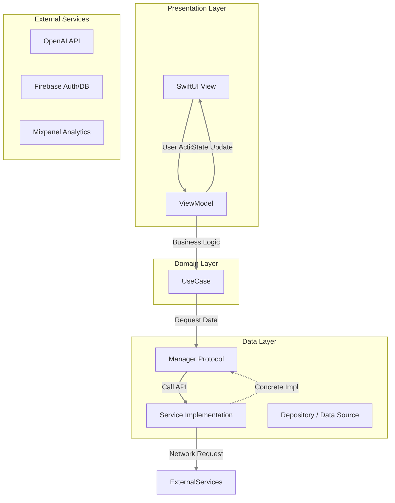
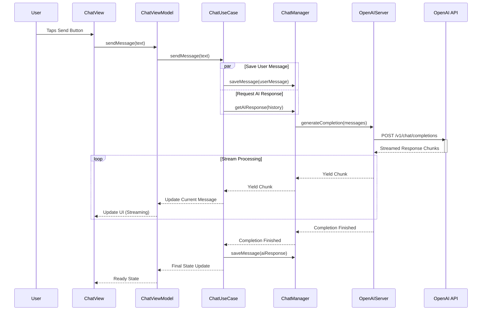
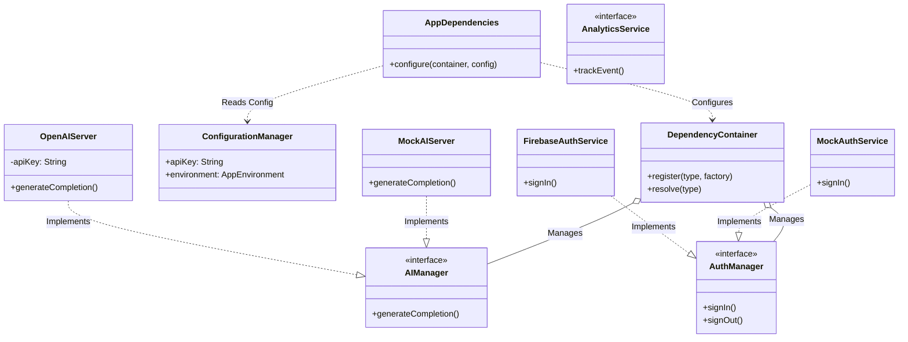

# System Design

This document outlines the system architecture and design of the AIChat application using Mermaid.js diagrams.

## 1. High-Level Architecture

AIChat follows **Clean Architecture** principles with **MVVM** pattern. The application is structured into three main layers: Presentation (View & ViewModel), Domain (UseCase), and Data (Manager & Service).

## 2. Message Flow Sequence Diagram

This diagram illustrates the end-to-end flow when a user sends a chat message.

## 3. Core Components Class Diagram

This diagram shows the relationships between the Dependency Container, Protocols, and Concrete Implementations, highlighting the Dependency Injection pattern.

